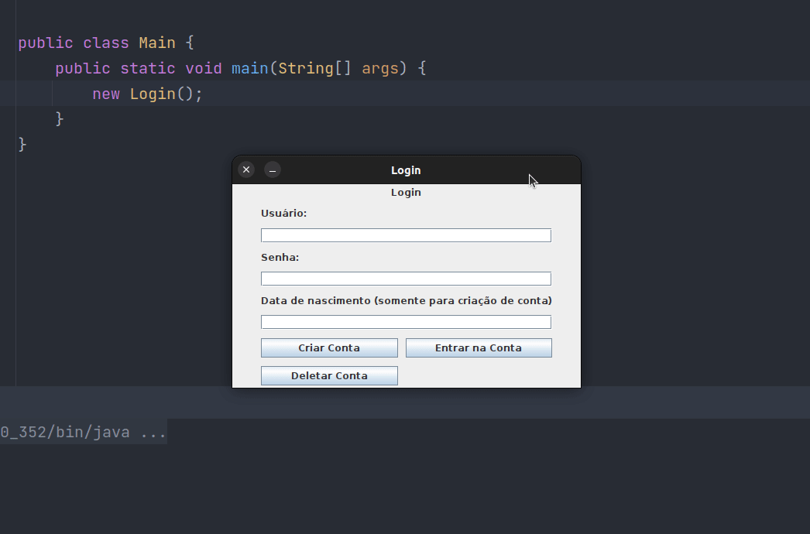

# POO
Programação Orientada a Objetos

 • As listas contém seus respectivos enunciados em suas pastas e as APs (aulas praticas) são em grande maioria implementações de diagramas UML

 • A pasta TRABALHO_FINAL é o trabalho final produzido na disciplina, ele consiste em um catálogo de Streaming onde o usuário pode adicionar filmes e séries e vizualizar seus detalhes e capas, a interface gráfica foi feita com **Java Swing** e o banco de dados é **postgresSQL**

-----------------------

Object Oriented Programming

• The lists contain their respective statements in their folders and the APs (practical classes) are mostly implementations of UML diagrams

• The TRABALHO_FINAL folder is the final work produced in the course, it consists of a Streaming catalog where the user can add movies and series and view their details and covers, the graphical interface was made with **Java Swing** and the database is **postgresSQL**
## Java Streaming Catalog

